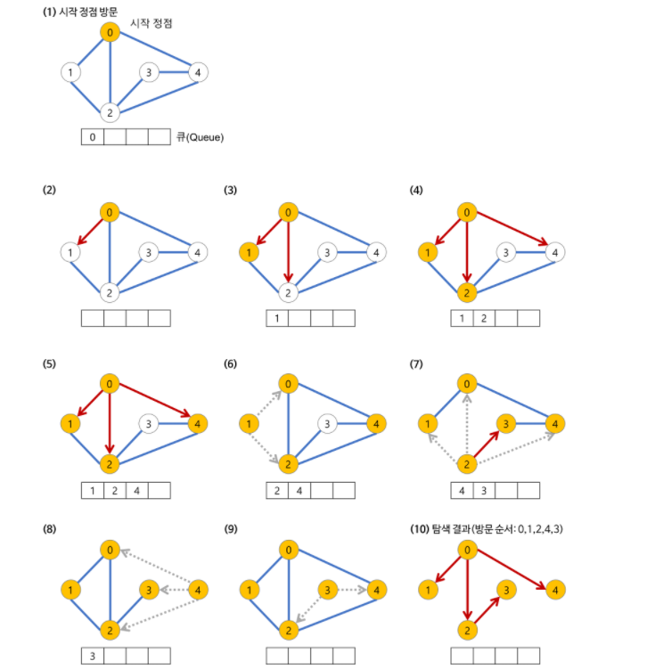
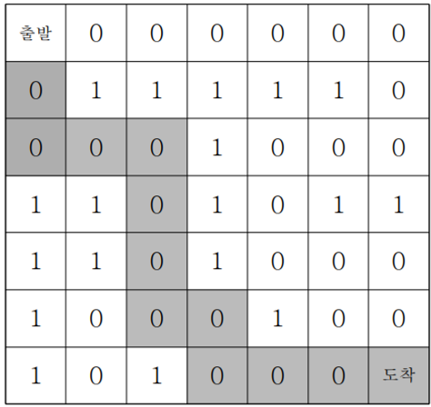

## 오늘의 스터디

## BFS

+ BFS(Breadth First Search)
  + 루트 노드에서 시작해서 인접한 노드를 먼저 탐색하는 방법
+ BFS에서의 노드 탐색 순서
  
  + 깊이가 가장 얕은 노드부터 모두 탐색한 뒤 깊이가 깊은 노드를 탐색하는 방법
  + 그림처럼 깊이가 1인 노드1과 노드2 탐색, 깊이가 1인 노드를 모두 탐색하였으므로 깊이가 2인 노드 3, 4, 5, 6을 탐색하는 순서
+ BFS의 특징
  + 두 노드사이의 최단경로를 탐색할때 활용하기 좋은 방식
  + 큐를 활용해서 탐색할 노드의 순서를 저장하고 큐에 저장된 순서대로 탐색(선입선출의 방식을 활용)

###  BFS 구현 알고리즘
1. 루트노드에서 시작한다.
2. 루트노드와 인접하고 방문된적 없고, 큐에 저장되지 않은 노드를 Queue에 넣는다.
3. Queue에서 dequeue하여 가장 먼저 큐에 저장한 노드를 방문한다.

출처: https://bbangson.tistory.com/42


### 그래프 구현 방식

+ 그래프는 **인접행렬**과 **인접리스트**로 구현 가능
1. 인접행렬로 구현
   1. 인접행렬로 배열(int[][] graph)
   2. 방문여부 배열(boolean[] BFSisVisited)
   3. 큐(Queue)
   4. 방문한 노드를 순서대로 저장하는 배열(ArrayList BFS)
2. 인접리스트로 구현
   1. 인접리스트 ( ArrayList[] graph )
   2. 방문여부 배열 ( boolean[] BFSisVisited )
   3. 큐 ( Queue queue )
   4. 방문한 노드를 순서대로 저장하는 배열 ( ArrayList BFSvisitArr )

### BFS 예제문제
미로의 최단거리 통로(BFS)

+설명

7*7 격자판 미로를 탈출하는 최단경로의 길이를 출력하는 프로그램을 작성하세요.

경로의 길이는 출발점에서 도착점까지 가는데 이동한 횟수를 의미한다.
출발점은 격자의 (1, 1) 좌표이고, 탈출 도착점은 (7, 7)좌표이다.
격자판의 1은 벽이고, 0은 도로이다. 격자판의 움직임은 상하좌우로만 움직인다. 미로가 다음과 같다면



위와 같은 경로가 최단경로의 길이는 12이다.

+ 입력
  + 첫 번째 줄부터 7*7 격자의 정보가 주어진다.

+ 출력
  + 첫 번째 줄에 최단으로 움직인 칸의 수를 출력한다. 도착할 수 없으면 -1를 출력한다.

예시입력
  ```
0 0 0 0 0 0 0
0 1 1 1 1 1 0
0 0 0 1 0 0 0
1 1 0 1 0 1 1
1 1 0 1 0 0 0
1 0 0 0 1 0 0
1 0 1 0 0 0 0
```

예시출력
```
12
```

풀이코드
```java
import java.io.BufferedReader;
import java.io.InputStreamReader;
import java.util.LinkedList;
import java.util.Queue;
import java.util.StringTokenizer;

public class Main {
    static int[][] arr,dis;
    static int[] dx = {-1, 0, 1, 0};
    static int[] dy = {0, 1, 0, -1};
    public static void main(String[] args) throws Exception {
        BufferedReader br = new BufferedReader(new InputStreamReader(System.in));
        arr = new int[7][7];
        dis = new int[7][7];
        for (int i = 0; i < 7; ++i) {
            StringTokenizer st = new StringTokenizer(br.readLine());
            for (int j = 0; j < 7; ++j) {
                arr[i][j] = Integer.parseInt(st.nextToken());
            }
        }
        arr[0][0] = 1;
        bfs(0, 0);
        if(dis[6][6]==0) System.out.println("-1");
        else System.out.println(dis[6][6]);
    }

    public static void bfs(int x, int y) {
        Queue<Point> q = new LinkedList<>();
        q.offer(new Point(x, y));
        while (!q.isEmpty()) {
            Point tmp = q.poll();
            for (int i = 0; i < 4; ++i) {
                int nx = tmp.x + dx[i];
                int ny = tmp.y + dy[i];
                if (nx >= 0 && nx <= 6 && ny >= 0 && ny <= 6 && arr[nx][ny] == 0) {
                    arr[nx][ny]=1;
                    q.offer(new Point(nx, ny));
                    dis[nx][ny] = dis[tmp.x][tmp.y] + 1;
                }
            }
        }
    }
    public static class Point{
        int x;
        int y;
        Point(int x, int y) {
            this.x=x;
            this.y = y;
        }
    }
}

```

## DP

다이나믹 프로그래밍(또는 동적 계획법)은 복잡한 문제를 더 작은 하위 문제로 나누어 해결하는 알고리즘 설계 기법
- 알고리즘 설계 기법: 문제 해결을 위해 알고리즘을 설계하는 방법이나 접근 방식을 나타냄. 설계 기법은 알고리즘을 개발하고 구현하는 데 사용되는 전략이나 원칙들을 포함

  ex) **분할 정복, 동적 계획법, 탐욕적 알고리즘, 백트래킹 등**

### DP과 재귀적 호출의 차이점

1. **하향식(Top-down) vs 상향식(Bottom-up) 접근**
  - 재귀적 호출은 주로 큰 문제를 작은 하위 문제로 나누어 해결하는 방식인 `하향식(top-down)` 접근 방식을 사용
  - 동적 계획법은 작은 하위 문제들부터 시작하여 그 결과를 저장하고, 이를 이용하여 점진적으로 큰 문제의 해를 구해나가는 `상향식(bottom-up)` 접근 방식을 사용
2. **메모이제이션(Memoization)**
  - 동적 계획법은 중복되는 **계산 결과를 저장**하는 메모리 기법인 메모이제이션을 사용
  - 재귀적 호출에서의 중복 계산을 방지하고 계산 속도를 향상

---
### **DP 기법을 적용시킬 수 있는 조건**

1. **중복되는 부분 문제(Overlapping Subproblems)**
  - DP는 기본적으로 문제를 나누고 그 문제의 결과 값을 재활용해서 전체 답을 구함, 그래서 동일한 작은 문제들이 반복하여 나타나는 경우에 사용이 가능
2. **최적 부분 구조(Optimal Substructure)**
  - 부분 문제의 최적 결과 값을 사용해 전체 문제의 최적 결과를 낼 수 있는 경우 사용이 가능

## 대표적인 DP 문제

### 1. 피보나치 수열 > Top-Down 방식

피보나치 수열은 이전 **두 항의 합**으로 이루어지는 수열입니다.
동적 계획법을 사용하여 피보나치 수열을 구할 수 있습니다.
작은 문제부터 시작하여 계산 결과를 저장하고 이를 이용하여 큰 문제의 해를 구합니다.

```java
public static int fibonacci(int n) {
    // 🌟 메모이제이션 🌟
    // 피보나치 수열을 저장할 배열
    int[] dp = new int[n + 1];

    // 초기값 설정
    dp[0] = 0;
    dp[1] = 1;

    // 🌟 점화식 🌟
    // 피보나치 수열 계산
    for (int i = 2; i <= n; i++) {
        dp[i] = dp[i - 1] + dp[i - 2];
    }

    // 결과 반환
    return dp[n];
}

public static void main(String[] args) {
    // 예시로 n = 10일 때 피보나치 수열 값 출력
    System.out.println(fibonacci(10)); // Output: 55
}
```

### 재귀를 통한 피보나치 수열(매모이제이션)
```java
import java.util.Scanner;

public class Sol0704FibonacciSol3 {
    //피보나치 수열을 출력
    //입력설명 항수 3<=n<=45
    //피보나치 출력
    //input : 10
    //output : 1 1 2 3 5 8 13 21 34 55
    static int[] fibonacci;
    public static void main(String[] args) {
        //sol 3: 매모이제이션 사용
        Scanner sc = new Scanner(System.in);
        int n = sc.nextInt();

        fibonacci=new int[n+1]; //index 0번은 버린다.
        dfs(n);
        for (int i = 1; i < n+1; ++i) {
            System.out.print(fibonacci[i] + " ");
        }
    }

    public static int dfs(int n) {
        if(fibonacci[n]>0) return fibonacci[n]; //값이 갱신되어있는지 확인
        //되어있으면 있는 값 재사용, 없으면 피보나치 dfs 수행
        if (n == 1 || n == 2) return fibonacci[n]=1;
        else return fibonacci[n]=dfs(n - 1) + dfs(n - 2);
    }
}

```


## 오늘의 목표
BFS(너비 우선 탐색)과 DP(동적 계획법)를 알아보자.

## 2주차 피드백

알고리즘 코드 챌린지에 나오는 문제들이 우리들의 실력과 차이가 크다.</br>
알고리즘 코드 챌린지에서 나오는 기초적인 알고리즘 BFS와 DP의 예제를 살펴보고, 알고리즘의 기초를 탄탄히 쌓자.</br>


